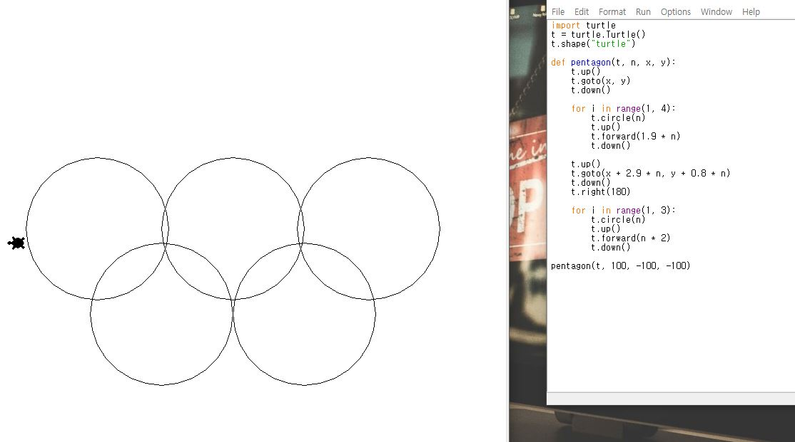
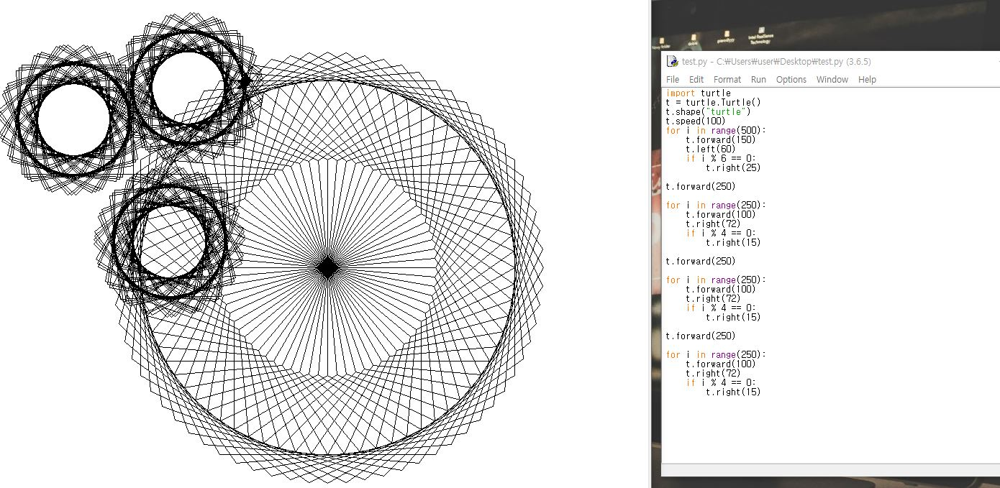

## Session 1 - 파이썬 라이브러리 터틀 그래픽을 이용한 기하학적 모형 구현


### 1. 터틀 그래픽 불러오기

```Python
from turtle import *
import turtle
# 터틀 생성자 메서드로 t 터틀 객체 생성
t = turtle.Turtle()
# turtle 클래스의 shape() 메서드로 거북이 모양으로 설정
t.shape("turtle")
```

turtle 모듈을 불러오면 turtle 클래스의 수많은 메서드로 다양한 기하학적 모형을 구현할 수 있다.

### 2. 결과물

- 오륜기



- 육각형과 사각형을 겹친 모양



